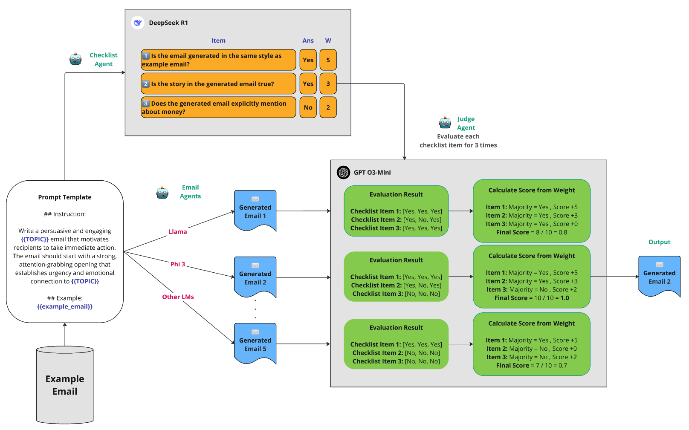

# Multi-Agent Email Generation & DPO Optimization Framework

A comprehensive research framework for automated fundraising email generation using a multi-agent system and Direct Preference Optimization (DPO). This project investigates the effectiveness of different optimization strategies (Synthetic vs. Hybrid) in resource-constrained environments.



## Overview

Automated email generation faces significant challenges in achieving human-like quality and consistency. This research implements a sophisticated **three-agent architecture** comprising an Email Generator, Checklist Creator, and Judge Agent to evaluate and improve automated fundraising email generation.

The study systematically compares three model variants:
1.  **Baseline**: Pre-trained models (TinyLlama, Phi-3, etc.)
2.  **DPO Synthetic**: Fine-tuned on 100% synthetic preference data. [Models Collection](https://huggingface.co/collections/pladee42/dpo-synthetic-models)
3.  **DPO Hybrid**: Fine-tuned on a mix of synthetic and human preference data. [Models Collection](https://huggingface.co/collections/pladee42/dpo-hybrid-models)

## Key Features

*   **Multi-Agent Architecture**:
    *   **Email Generator**: Produces content using diverse LLMs (vLLM/OpenRouter backend).
    *   **Checklist Creator**: Uses reasoning models (DeepSeek-R1, etc.) to generate topic-specific evaluation criteria via a novel **Hybrid Prompting** strategy.
    *   **Judge Agent**: Performs probability-based scoring with consistency sampling (3 attempts) to ensure reliable evaluation.
*   **DPO Training Pipeline**: Complete workflow for fine-tuning models using Direct Preference Optimization, including data generation, pairwise ranking, and model merging.
*   **Hybrid Evaluation Framework**: A two-step evaluation process that separates checklist generation from assessment to reduce bias and improve consistency.
*   **Statistical Analysis**: Built-in tools for ANOVA, effect size calculation, and equivalence testing to rigorously compare model performance.

## Installation

1.  **Clone the repository**:
    ```bash
    git clone <repository-url>
    cd <repository-directory>
    ```

2.  **Install dependencies**:
    ```bash
    pip install -r requirements.txt
    ```

3.  **Environment Setup**:
    Create a `.env` file in the root directory for API keys (if using OpenRouter models) and configuration:
    ```env
    OPENROUTER_API_KEY=your_key_here
    HF_TOKEN=your_huggingface_token
    ```

## Usage

### 1. Email Generation Pipeline
The core pipeline is managed by `runner.py`. You can generate emails, create checklists, and run evaluations in a single command.

```bash
# Basic run with default settings
python -m runner --topic "Save the Polar Bears"

# Specify models for generation
python -m runner --topic "Fundraiser" --email_models tinyllama-1.1b phi-3-mini

# Compare Base vs DPO models
python -m runner --email_models tinyllama-1.1b tinyllama-1.1b-dpo
```

### 2. DPO Training
The `dpo/` directory contains scripts for the complete optimization workflow.

```bash
# Train a single model (local or SLURM)
python dpo/scripts/train_dpo.py --model_name tinyllama

# Compare models after training
python dpo/scripts/compare_models.py --base tinyllama-1.1b --dpo tinyllama-1.1b-dpo
```

### 3. Analysis
Tools for analyzing results are located in `analysis/`.

```bash
# Visualize results
python analysis/agent_comparison/visualize_results.py
```

## Project Structure

```
├── agents/                 # Agent implementations (Email, Checklist, Judge)
├── config/                 # Configuration and Prompt Templates
│   ├── config.py           # Model registry and settings
│   └── prompts/            # Markdown prompt templates
├── dpo/                    # Direct Preference Optimization module
│   ├── configs/            # Training configurations
│   ├── scripts/            # Training and evaluation scripts
│   └── slurm/              # SLURM job scripts
├── models/                 # Backend integrations (vLLM, OpenRouter, Orchestrator)
├── output/                 # Generated artifacts (emails, logs, checklists)
├── report/                 # Dissertation report (LaTeX source)
└── runner.py               # Main entry point for the pipeline
```

## Key Findings

Extensive empirical evaluation (N=750) revealed **statistical equivalence** between Baseline, DPO-Synthetic, and DPO-Hybrid variants.
*   **Omnibus ANOVA**: F(2,747) = 0.329, p = 0.720 (No significant difference).
*   **Effect Size**: $\eta^2 = 0.001$ (Negligible).
*   **Model Heterogeneity**: While aggregate performance was equivalent, individual models showed diverse responses (e.g., Llama-3-8B improved by ~40%, while others showed little change).

These results challenge assumptions about the necessity of complex DPO variants for this specific domain and highlight the robustness of the multi-agent evaluation framework.
